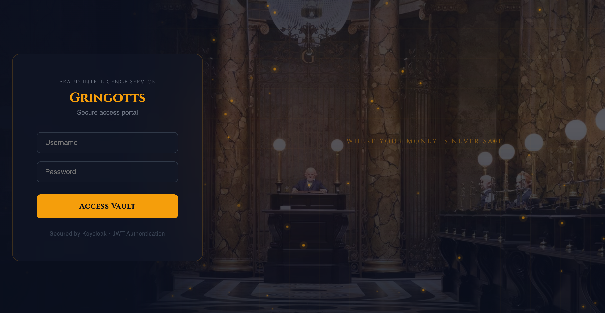
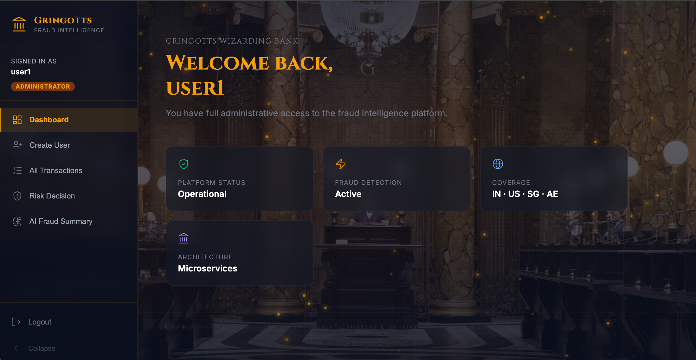
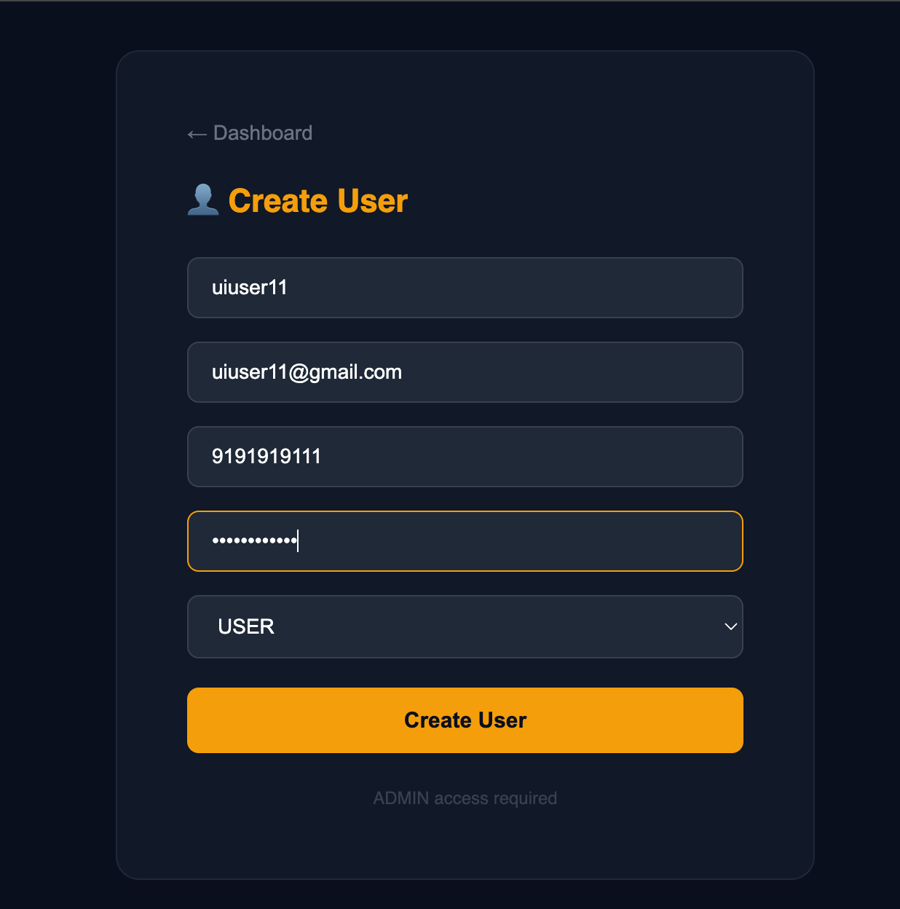
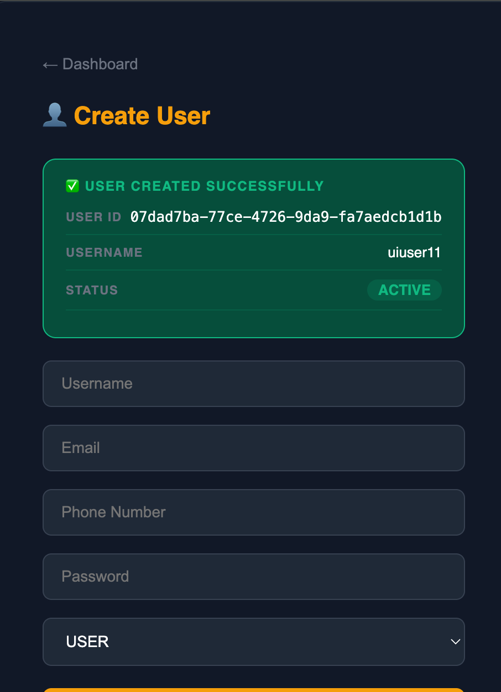
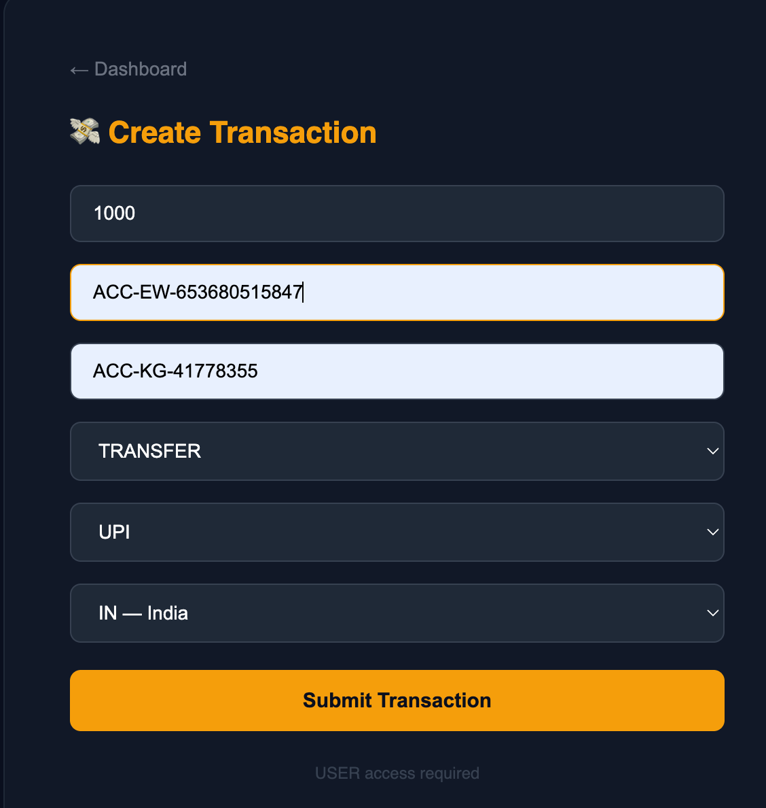
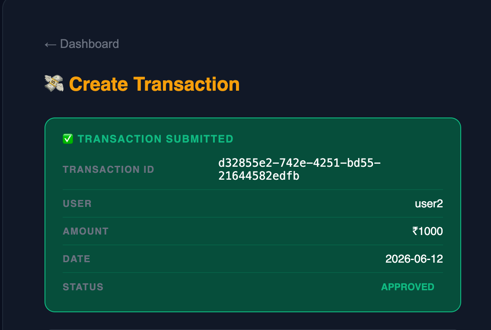
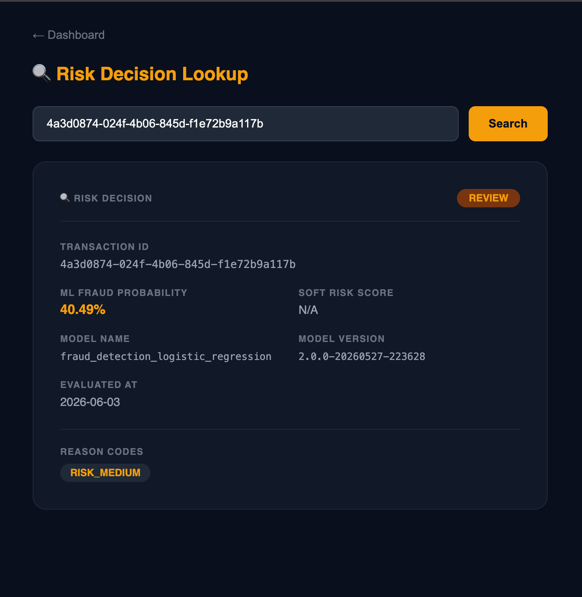
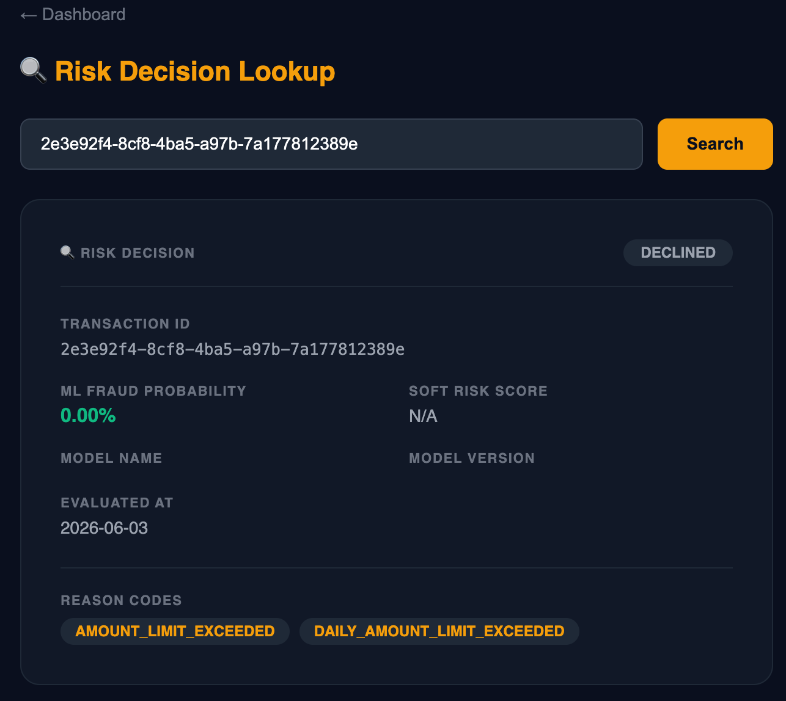
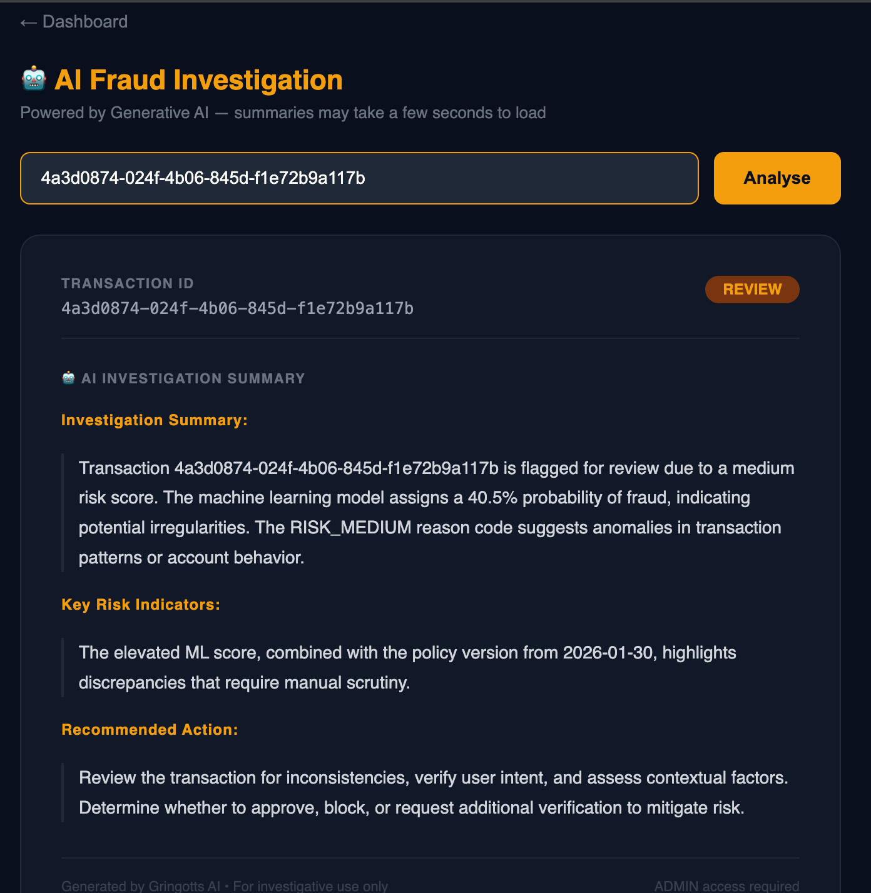
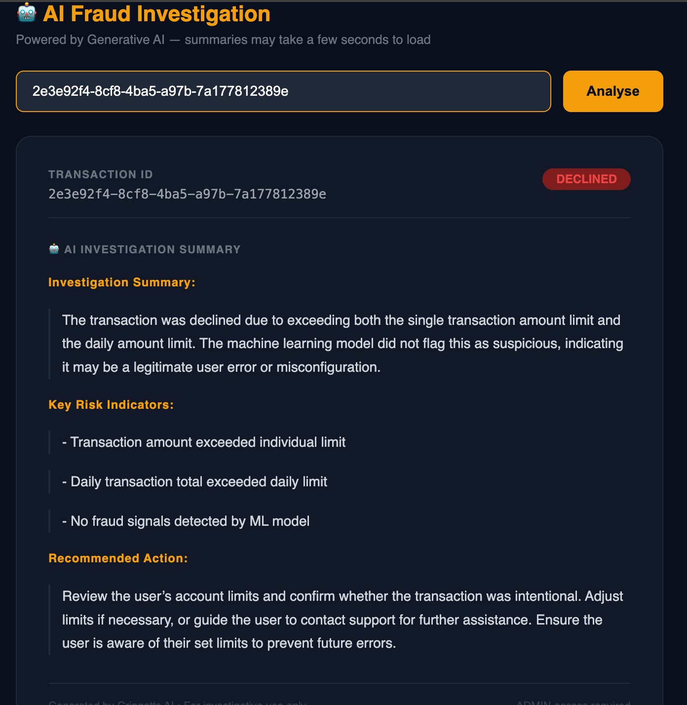

# Gringotts Fraud Platform

# Distributed Event-Driven AI-Assisted ML-Powered Transaction Fraud Detection Platform

## Overview

Gringotts Fraud Platform is a production-style distributed financial transaction processing, fraud detection, and AI-assisted investigation platform designed using modern microservice architecture principles.

The platform simulates how enterprise-grade banking and fintech systems process secure transactions while performing:

- real-time fraud detection
- behavioral risk evaluation
- ML-powered fraud scoring
- AI-powered fraud investigation summaries
- explainable fraud decisioning
- distributed transaction orchestration
- event-driven communication
- audit-safe observability
- retry-safe asynchronous processing
- secure machine-to-machine authentication

The architecture combines:

- synchronous orchestration
- asynchronous event processing
- distributed consistency patterns
- resilient infrastructure
- operational observability
- ML-based fraud decisioning
- Generative AI-powered fraud explainability

to emulate real-world financial backend systems used by modern banks and fintech organizations.

The platform demonstrates how Machine Learning and Generative AI can work together within a financial risk ecosystem:

- Machine Learning predicts fraud probability
- Policy engines make deterministic approval decisions
- Generative AI explains fraud outcomes in business-readable language
- Fraud analysts receive AI-generated investigation summaries and recommended actions

This separation preserves deterministic and auditable fraud decisions while introducing enterprise-grade AI-assisted investigation capabilities.

---

# Core Architecture Goals

The platform is designed to demonstrate:

- distributed systems engineering
- microservice orchestration
- event-driven architecture
- fraud evaluation pipelines
- resilient transaction workflows
- distributed idempotency
- transactional consistency
- secure service communication
- observability-first architecture
- ML integration in backend systems
- generative AI integration
- AI-assisted fraud investigation
- explainable AI workflows
- LLM-powered operational analysis

---

# System Architecture

```text
                    +----------------------+
                    |      API Client      |
                    +----------+-----------+
                               |
                               v

                  +----------------------------------+
                  |          Gateway Service         |
                  |----------------------------------|
                  | Authentication                   |
                  | Authorization                    |
                  | Routing                          |
                  | Rate Limiting                    |
                  | Circuit Breaking                 |
                  | Observability                    |
                  +----------------+-----------------+
                                   |
         ---------------------------------------------------------
         |             |         |                    |           |
         v             |         v                    |           v
                       |                              |
+------------------+   |  +------------------+        |        +------------------------+.     +------------------------+
|   User Service   |   |  |Transaction Svc   |  synch.|  Feign | Risk Decision          |      |   AI Investigation     |
|                  |   |  |                  | -------|------->| Service                |--->. |         Summary        |
|                  |      |                  |                 | Hard rules, Ml Scoring |      | Spring AI,Ollama,Prompt|
|                  |   |  |                  |                 | policy,Ollama,Spring AI|      | Builder.Explainability |
+------------------+   |  +------------------+        |        +------------------------+      +------------------------+
                       |         |                    |                   ^
                       |         |                    |                   |
                       |         |                    |                   |
                       |         v                    |.       +----------------------+
                       |                              |        |  Logestic Regression |
                       |   +----------------------+.  |.       |.   ptyhon pipeline.  |
                       |   |        Kafka         |.  |        +----------------------+
                       |   +----------------------+.  |
                       v         |                    v
               -----------------------------------------------
               |                                           |
               v                                           v

+-----------------------------+         +-----------------------------+
| Notification Service        |         | Transaction Observability   |
|                             |         | Service                     |
+-----------------------------+         +-----------------------------+

```

---

# Future Architecture Diagram Placeholder

```text
[ INSERT FINAL SYSTEM FLOW DIAGRAM HERE ]
```

---

# Future Request Flow Placeholder

```text
[ INSERT DISTRIBUTED REQUEST FLOW DIAGRAM HERE ]
```

---

# Application Walkthrough

The platform provides a Gringotts-themed frontend that demonstrates the complete fraud investigation workflow.

## Authentication



Secure authentication using Keycloak and OAuth2.

## Administrative Dashboard

The administrator dashboard acts as the operational control center for the platform. Administrators can manage users, review transactions, inspect fraud decisions, and access AI-generated investigation summaries.



---

## User Onboarding Workflow

New users are provisioned through the User Service and secured using Keycloak-based authentication and authorization.

### Create User

Administrators can create new platform users and assign appropriate roles.



### User Creation Confirmation

Successful onboarding generates a unique user identifier and activates the account within the platform.



---

## Transaction Processing Workflow

Users can initiate financial transactions that are subsequently evaluated by the fraud detection pipeline.

### Create Transaction

Transaction details including amount, account information, transaction type, payment method, and country are submitted through the platform.



### Transaction Submission Confirmation

After successful validation and processing, the platform generates a transaction identifier and records the initial transaction state.



---

## Fraud Detection & Risk Evaluation

The Risk Decision Service combines deterministic fraud policies with machine learning models to evaluate transaction risk.

### Review Required Transaction

This example shows a transaction flagged for manual review based on machine learning risk analysis.



Key information provided:

- Fraud probability score
- Model metadata
- Risk classification
- Explainable reason codes
- Decision status

### Declined Transaction

This example demonstrates a transaction rejected by business policy rules despite a low machine learning fraud probability.



This highlights the separation between:

- Machine learning predictions
- Deterministic fraud policies
- Final business decisions

---

## AI-Assisted Fraud Investigation

Spring AI and Ollama are integrated to provide explainable fraud investigation summaries for analysts.

### Review Investigation Summary

For transactions requiring manual review, the platform generates contextual explanations and recommended analyst actions.



The summary includes:

- Investigation overview
- Risk indicators
- Supporting evidence
- Recommended next actions

### Declined Transaction Investigation

For policy-rejected transactions, the AI layer explains the decision rationale and provides analyst guidance.



This capability improves transparency and reduces manual investigation effort while maintaining deterministic decision authority within the fraud platform.

---

# Core Services

| Service                           | Responsibility                                         |
| --------------------------------- | ------------------------------------------------------ |
| gateway-service                   | Centralized API gateway, security, routing, resilience |
| user-service                      | User lifecycle management and Keycloak integration     |
| transaction-service               | Distributed transaction orchestration                  |
| risk-decision-service             | Fraud detection and ML-based risk evaluation           |
| notification-service              | Asynchronous email notification processing             |
| transaction-observability-service | Immutable audit persistence and analytics              |
| ml-risk-model                     | ML pipeline for fraud model training/export            |

---

# Infrastructure Components

| Component  | Purpose                                               |
| ---------- | ----------------------------------------------------- |
| MySQL      | Persistent storage                                    |
| Redis      | Distributed locking and caching                       |
| Kafka      | Event-driven communication                            |
| Keycloak   | Identity and access management                        |
| Prometheus | Metrics collection                                    |
| Grafana    | Operational dashboards                                |
| Docker     | Containerized infrastructure                          |
| Ollama     | Local LLM inference for fraud investigation summaries |

---

# Key Architectural Concepts

The platform implements several production-grade backend engineering concepts:

- distributed transaction orchestration
- event-driven architecture
- transactional outbox pattern
- distributed idempotency
- Redis-based coordination
- Kafka asynchronous messaging
- ML-powered fraud scoring
- behavioral fraud analysis
- secure JWT authentication
- OAuth2 resource server security
- observability-first architecture
- retry-safe workflows
- eventual consistency
- fault-tolerant orchestration
- AI-assisted fraud investigation
- Generative AI integration
- Spring AI orchestration
- LLM-powered explainability
- investigation summary generation
- AI observability and inference monitoring

---

# Gateway Service

The Gateway Service acts as the centralized security and routing layer.

Responsibilities include:

- JWT authentication
- route authorization
- centralized request routing
- Redis-backed rate limiting
- circuit breakers
- retry handling
- correlation ID propagation
- observability instrumentation

Built Using:

- Spring Cloud Gateway
- Spring WebFlux
- Spring Security
- Keycloak
- Redis
- Resilience4j

---

# User Service

Responsible for:

- user lifecycle management
- Keycloak integration
- JWT-based authorization
- Redis caching
- resilient identity-provider communication

Features:

- cache-aside pattern
- compensating transactions
- ownership-based authorization
- role-based access control
- resilience-protected IAM integration

---

# Transaction Service

Acts as the distributed orchestration engine of the platform.

Responsibilities:

- transaction lifecycle orchestration
- idempotent request handling
- fraud-service integration
- outbox event publishing
- distributed coordination

Implemented Concepts:

- Redis distributed locking
- transactional outbox pattern
- Kafka event publishing
- synchronous risk evaluation
- retry-safe orchestration

---

# Risk Decision Service

Enterprise-grade fraud evaluation engine.

The service performs:

- deterministic hard-rule evaluation
- heuristic behavioral analysis
- ML fraud scoring
- policy decision orchestration
- explainable fraud evaluation

Key Features:

- Redis-backed idempotency
- ML inference pipeline
- behavioral intelligence
- explainable reason codes
- audit-safe persistence
- distributed-safe orchestration

AI-Powered Fraud Investigation

The service includes a Generative AI investigation layer that transforms fraud evaluation results into business-readable investigation reports.

Capabilities:

Spring AI integration
Ollama-hosted local LLM
Fraud investigation summary generation
Analyst recommendation generation
Risk indicator explanation
Redis-cached investigation reports

Investigation flow:

Risk Decision Trace
|
v
FraudPromptBuilder
|
v
Spring AI ChatClient
|
v
Ollama
|
v
Investigation Summary

The AI layer does not participate in fraud decisioning.

Authoritative decisions remain within:

Hard Rules

- Soft Rules
- ML Scoring
- Policy Engine

The AI layer only provides:

explainability
analyst guidance
business-readable summaries

---

# Notification Service

Asynchronous communication microservice responsible for:

- Kafka event consumption
- transactional email delivery
- AWS SES integration
- notification failure recovery
- retry-safe event processing

The service isolates communication workloads from transaction orchestration.

---

# Transaction Observability Service

Centralized audit and analytics platform.

Responsibilities include:

- immutable audit persistence
- Kafka event consumption
- Excel-based export generation
- operational analytics
- forensic-grade transaction traceability
- failed-event persistence

The architecture separates analytics workloads from transactional processing.

---

# ML Risk Model Pipeline

The ML pipeline powers the fraud-intelligence layer of the platform.

Capabilities include:

- synthetic transaction generation
- behavioral feature engineering
- fraud labeling
- logistic regression model training
- Java-compatible model export

The exported model artifact is consumed by:

```text
risk-decision-service
```

The architecture maintains:

- Python ↔ Java feature parity
- deterministic inference
- production-safe scoring consistency

---

# Security Architecture

The platform uses:

```text
OAuth2 Resource Server + JWT Authentication + Keycloak
```

Security features include:

- stateless authentication
- machine-to-machine trust
- role-based authorization
- audience validation
- JWT propagation
- secure gateway enforcement

---

# Event-Driven Architecture

Kafka powers asynchronous communication between services.

Primary asynchronous workflows:

- transaction finalized events
- notification events
- observability events
- audit persistence flows

The platform implements:

```text
Transactional Outbox Pattern
```

to ensure reliable event delivery.

---

# Redis Architecture

Redis is used for:

- distributed locking
- idempotency handling
- retry-safe orchestration
- duplicate request prevention
- caching

---

# Observability Stack

The platform includes operational observability using:

- Micrometer
- Prometheus
- Grafana
- structured logging
- correlation IDs
- health probes
- metrics instrumentation

Supports:

- latency monitoring
- request tracing
- failure analytics
- operational debugging
- SLA visibility

* AI request count
* AI success rate
* AI failure rate
* LLM inference latency
* investigation cache effectiveness

---

# Containerization

The platform supports containerized execution using Docker.

Containerized components include:

- microservices
- Redis
- Kafka
- MySQL
- Keycloak
- observability stack
- ML pipeline

The architecture is designed for future cloud-native deployment.

---

# Repository Structure

```text
final-project/
│
├── docs/
├── infra/
├── services/
├── ml-risk-model/
│
├── README.md
└── .gitignore
```

---

# Local Setup Flow

## Step 1 — Start Infrastructure

Run infrastructure containers:

- MySQL
- Redis
- Kafka
- Keycloak
- Prometheus
- Grafana

---

## Step 2 — Run ML Pipeline

Generate fraud model artifact:

```bash
python run_pipeline.py
```

---

## Step 3 — Start Microservices

Start services in appropriate order:

1. gateway-service
2. user-service
3. risk-decision-service
4. transaction-service
5. notification-service
6. transaction-observability-service

---

# Documentation

| Document              | Purpose                  |
| --------------------- | ------------------------ |
| docs/ARCHITECTURE.md  | Deep system architecture |
| docs/OBSERVABILITY.md | Monitoring and tracing   |
| docs/API_REFERENCE.md | API overview             |
| docs/ML_PIPELINE.md   | ML pipeline architecture |

---

# Production-Grade Concepts Demonstrated

The project demonstrates implementation of:

- distributed systems
- microservice orchestration
- event-driven communication
- distributed idempotency
- eventual consistency
- resilient orchestration
- secure machine authentication
- Kafka asynchronous messaging
- Redis coordination
- ML integration in backend systems
- observability-first engineering
- fraud detection pipelines

---

# Future Enhancements

Planned future improvements include:

- Kubernetes deployment
- OpenTelemetry tracing
- centralized logging
- service discovery
- schema registry integration
- feature-store integration
- model registry support
- stream processing
- autoscaling infrastructure
- cloud-native deployment
- object-storage-backed ML artifacts

---

# Learning Outcomes

This project demonstrates practical implementation of:

- enterprise Java backend engineering
- distributed systems architecture
- event-driven backend workflows
- fraud detection engineering
- ML-enhanced transaction processing
- resilient microservice communication
- operational observability
- secure distributed authentication
- scalable backend architecture

---

# Final Summary

Gringotts Fraud Platform is a:

```text
Production-style distributed event-driven fraud detection and transaction processing platform enhanced with Machine Learning and Generative AI-powered fraud investigation capabilities.
```

The platform demonstrates:

secure transaction orchestration
ML-powered fraud evaluation
AI-assisted fraud investigation
asynchronous event processing
resilient distributed workflows
operational observability
scalable microservice architecture
fault-tolerant backend systems
explainable fraud decisioning
modern AI-enhanced backend engineering
